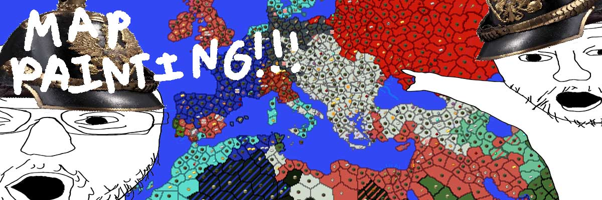

# Minecraft nodes plugin

Map painting but in block game. Contains server plugin and nodes dynmap viewer/editor extension.

**Documentation:** <https://nodes.soy>  
**Editor:** <https://editor.nodes.soy/earth.html>  
**Nodes in action (by Jonathan):** <https://www.youtube.com/watch?v=RVtcc010FpM>


# Repo structure
```
minecraft-nodes/
 ├─ docs/                 - Documentation source
 ├─ dynmap/               - Dynmap editor/viewer
 ├─ nodes/                - Dynmap editor/viewer
 |   └─ lib/              - Put built spigot dependency 
 ├─ ports/                - Nodes ports plugin
 └─ scripts/              - Utility scripts
```


# Build
This repository contains the following separate projects:
1.  Nodes main server plugin (root directory)
2.  Dynmap viewer/editor
3.  Plugin documentation
4.  Ports plugin


## 1. Building main server plugin (1.18.2)
Requirements:
- Java JDK 17 (current plugin target java version)

Go inside `nodes/` and run
```
./gradlew build -P 1.18
```
Built `nodes-1.18.2-SNAPSHOT-VERSION.jar` will appear in `build/libs/*.jar`.

To build without kotlin shaded into the jar (e.g. if using separate kotlin
runtime plugin for example my <https://github.com/phonon/minecraft-kotlin>),
run with following:
```
./gradlew build -P 1.18 -P no-kotlin
```


## 1.b. (OLD) Building main server plugin old version (1.16.5)
Requirements:
- Java JDK 16 (1.16.5 required plugin target java version)
- Manually building nms dependencies

In the later 1.18+ version build process, nms dependencies are handled
by gradle paperweight plugin <https://github.com/PaperMC/paperweight>.
However, for older versions we need to manually build and include the 
nms dependency. So this build process for 1.16.5 includes steps needed
to download, build, and manually include the `spigot-1.16.5.jar` for
nms dependencies.

First step will be to build spigot and craftbukkit jars:
- https://www.spigotmc.org/wiki/buildtools/
- https://www.spigotmc.org/wiki/spigot-nms-and-minecraft-versions-1-16/


### 1. Download BuildTools.jar: https://www.spigotmc.org/wiki/buildtools/#running-buildtools


### 2. Run BuildTool.jar to build `spigot-1.16.5.jar`.
```
java -jar BuildTools.jar --rev 1.16.5
```

### 3. Put `spigot-1.16.5.jar` into `nodes/lib/`.
This folder should now have path:
```
nodes/lib/spigot-1.16.5.jar
```


### 5. Build final plugin `nodes.jar`:
Go inside `nodes/` and run
```
./gradlew build -P 1.16
```
Built `.jar` will appear in `build/libs/*.jar`.


### 6. *(Optional)* Build final plugin without `kotlin`:
By default the build process shadows kotlin runtime dependency
into the `nodes.jar` so that it can be used as a standalone plugin.
In situations where `kotlin` runtime is shared across plugins,
this will build `nodes` without kotlin:
```
./gradlew build -P 1.16 -P no-kotlin
```
Nodes instead has a soft dependency on any plugin named `kotlin`.
This is intended for use with this kotlin runtime plugin:
https://github.com/phonon/minecraft-kotlin


-----------------------------------------------------------

## 2. Building dynmap viewer/editor
*See internal folder `dynmap/README.md` for more details*

Requirements:
- node.js
- Rust

-----------------------------------------------------------

## 3. Building plugin documentation
### Generating main plugin documentation
*See `docs/README.md`*

Requirements:
- Rust

### Generating nodes commands documentation
Requirements:
- Python 3

This script reads in documentation comments from in-game command
files in `src/main/kotlin/phonon/nodes/commands/*` and generates
documentation for in-game commands:
```
python scripts/generate_commands_docs.py
```
Run this in the git root directory every time in-game commands
are edited in `nodes/` source before re-building documentation site.

-----------------------------------------------------------

## 4. Building ports plugin
Requirements:
- Java JDK 16 (current plugin target java version)

### 1. Build main `nodes` plugin first (follow steps above).
Make sure there is the nodes output `.jar` at path
```
nodes/build/libs/nodes.jar
```

### 2. Build ports plugin `nodes-ports.jar`:
Go inside `ports/` and run
```
./gradlew build -P 1.16
```
Built `.jar` will appear in `build/libs/nodes-ports-1.16-*.jar`.


# Issues/Todo
See [TODO.md](./TODO.md) for current high-level todo list.


# License
Licensed under [GNU GPLv3](https://www.gnu.org/licenses/gpl-3.0.en.html).
See [LICENSE.md](./LICENSE.md).


# Acknowledgements
Special thanks to early contributors:
- **Jonathan**: coding + map painting
- **Doneions**: coding + testing + lole